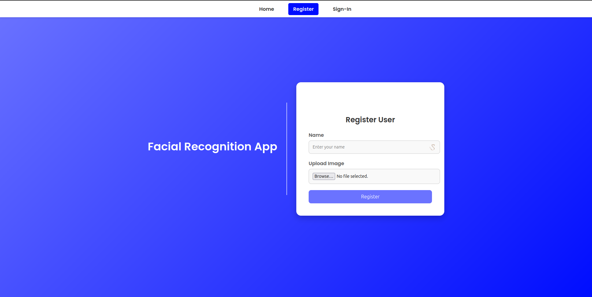
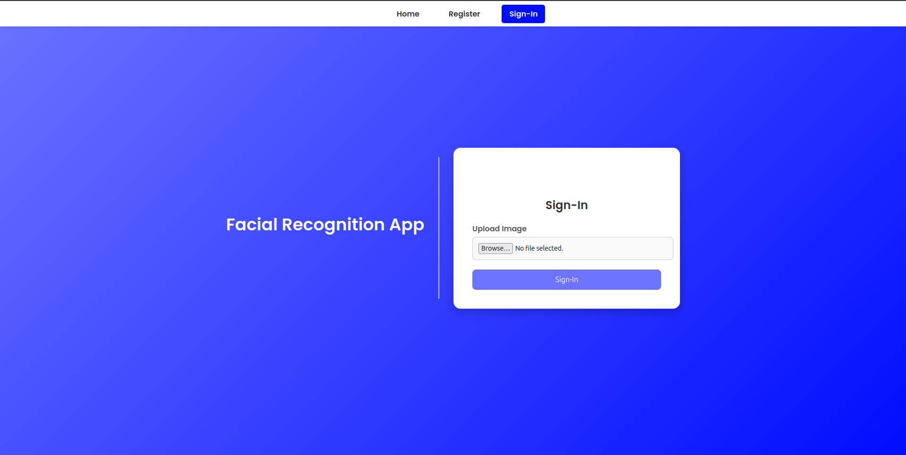

# Facial Recognition Web App

A fast and user-friendly facial recognition web application built with **FastAPI**. This app allows users to register and sign in using facial recognition technology, ensuring a seamless and secure authentication process.

---

## 🚀 Features

- **User Registration**: Upload your photo and register with your name.
- **Facial Authentication**: Sign in using facial recognition without passwords.
- **Modern UI/UX**: Sleek, responsive, and interactive user interface.
- **Real-time Feedback**: Instant form validation and toast notifications.
- **Lightweight & Fast**: Built with FastAPI for high performance.

---

## 🛠️ Tech Stack

- **Backend**: FastAPI, Python
- **Frontend**: HTML5, CSS3, JavaScript
- **Facial Recognition**: face_recognition library (built on dlib)

---

## 📂 Project Structure

```
facial-recognition/
├── static/
│   ├── css/
│   │   └── style.css
│   ├── images/
│   │   ├── register.png
│   │   ├── right-arrow.png
│   │   └── signin.png
│   └── js/
│       └── main.js
├── templates/
│   ├── base.html
│   ├── index.html
│   ├── register.html
│   └── sign-in.html
├── apps.py
├── models.py
├── README.md
└── requirements.txt
```

---

## ⚙️ Installation

1. **Clone the repository**

```bash
git clone git@github.com-personal:SyedMahad/facial-recognition.git
cd facial-recognition
```

2. **Create a virtual environment**

```bash
python -m venv venv
source venv/bin/activate  # On Windows: venv\Scripts\activate
```

3. **Install dependencies**

```bash
pip install -r requirements.txt
```

4. **Run the app**

```bash
uvicorn apps:app --reload
```

5. **Access the app**

Open your browser and go to: [http://127.0.0.1:8000](http://127.0.0.1:8000)

---

## 📸 Screenshots

### 🔹 **Home Page**

- Provides easy navigation for registration and sign-in.


### 🔹 **Register Page**

- Upload your image and register your name securely.


### 🔹 **Sign-In Page**

- Sign in with your registered face in seconds.


---

## 📝 API Endpoints

### 1. **Register User**

- **Endpoint**: `/register-user/`
- **Method**: `POST`
- **Payload**:
  - `name`: User's name (string)
  - `file`: Image file (jpg, png)

### 2. **Sign-In User**

- **Endpoint**: `/sign-in-user/`
- **Method**: `POST`
- **Payload**:
  - `file`: Image file (jpg, png)

---

## 🏗️ Future Improvements

- Integrate a database for persistent user storage.
- Implement email verification.
- Add multi-factor authentication.
- Optimize image processing for faster recognition.

---

## 🤝 Contributing

1. Fork the repository
2. Create your feature branch (`git checkout -b feature/new-feature`)
3. Commit your changes (`git commit -m 'Add new feature'`)
4. Push to the branch (`git push origin feature/new-feature`)
5. Open a Pull Request

---

## 📜 License

This project is licensed under the **MIT License**.

---

## 🙌 Acknowledgments

- [FastAPI](https://fastapi.tiangolo.com/)
- [face_recognition](https://github.com/ageitgey/face_recognition)
- [dlib](http://dlib.net/)
- [Next icons created by Roundicons - Flaticon](https://www.flaticon.com/free-icons/next)

---

## 📬 Contact

**Syed Mahad Ehsan**  
🔗 [mahadehsan.com](https://mahadehsan.com)  
💻 [GitHub](https://github.com/SyedMahad)

---

**Secure. Fast. Facial Authentication.** 🔐

